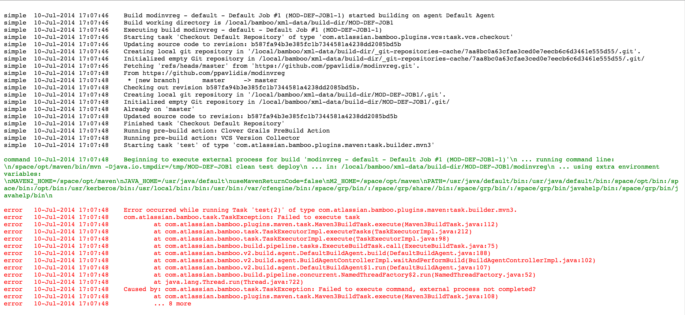

# Bamboo Log Enhancer

 

Simple Chrome extension and Firefox add-on that will add color to your Atlassian Bamboo log files, in order to distinguish `build`, `command`, `error`, and `simple` output.

## Preview

## Installation

Simply install the extension from the [Chrome Web Store](https://chrome.google.com/webstore/detail/bamboo-log-enhancer/hokokhlkakimconkkofafoklkefhnnpe) or [Firefox add-on](https://addons.mozilla.org/firefox/addon/bamboo-log-enhancer/).

## Development

1. Clone this repo: `git clone https://github.com/samueldg/bamboo-log-enhancer.git`;
2. Open Chrome and go to your extensions: `chrome://extensions`;
3. Make sure *Developer mode* is enabled;
4. Click *Load unpacked extension...* and select `bamboo-log-enhancer/extension`.

## Contribution

This project is still early stage, feel free to create a pull request and contribute!
